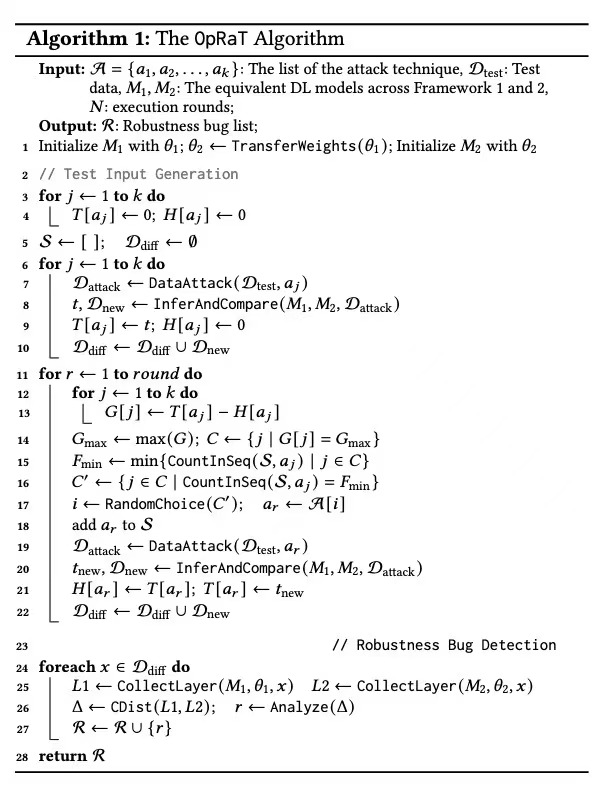

### OPRAT-PyTorch: 深度学习模型鲁棒性评估与模糊测试框架

本项目实现了一个针对 PyTorch 模型的自动化鲁棒性评估框架（OPRAT）。通过对抗攻击生成（Fuzzing）与环境消融实验（Stability Analysis），系统地评估模型在不同编译选项、精度和硬件设备下的行为一致性与鲁棒性。




**目录结构说明：**   
以TorchLeNet5为例：


**注意**：

1. 由于 `.pth` (模型权重) 和 `.npy` (攻击样本) 文件体积过大，默认不上传至 GitHub。

2. 完整汇总结果请参考根目录下的 `触发框架鲁棒性问题汇总.xlsx`。

3. 原始数据后续将托管于 Figshare。
   
   

**快速开始：**

1. 环境准备：确保已安装 Python 3.8+ 及 PyTorch 环境。
   
   ```bash
   pip install -r requirements.txt
   ```

2. 运行测试
   使用 `main.py` 启动测试。脚本支持断点续传，会自动加载已有的攻击样本。
   参数说明：
   
   * `--group`: 模型组编号 (0 或 1，详见 `config.py`)
   
   * `--gpu`: 指定使用的 GPU ID (参数-1则使用CPU)
   
   * `--mode`: 运行模式
     
     * `fuzz`: 仅运行第一阶段（对抗攻击生成）
     
     * `stability`: 仅运行第二阶段（稳定性/消融实验）
     
     * `all`: 顺序运行所有阶段（默认）
   
   运行示例：
   
   ```bash
   # 在 GPU 0 上运行第 0 组模型的所有测试阶段
   python main.py --group 0 --gpu 0 --mode all
   ```
   
   

**实验设置与逻辑：**

1. 基本参数
* Batch Size: 30

* Rounds: 100 轮次

* Total Test Cases: 3000 个测试样本
2. 第一阶段：初始攻击 (First Attack)

在标准 PyTorch 默认环境下生成对抗样本：

* Precision: Float32（PyTorch框架下默认Float32）

* Device: CUDA

* Compile: 默认参数 (`torch.compile()`)
3. 第二阶段：稳定性消融 (Re-Attack)

使用第一阶段生成的样本，在不同环境下进行二次推理，检测模型行为的不一致性（Label Change）：

* Compile Test: 测试不同的后端优化参数 (`fallback_random`, `epilogue_fusion` 等)。

* Device Test: 对比 CPU 与 CUDA 的推理差异。

* Precision Test: 对比 FP16 与 FP32 的推理差异。
4. 标签变化记录标准 (Label Change Metrics)

在记录 `label_change` 时，我们重点关注以下两类异常行为：

1. Different 组: 原先攻击成功（导致模型预测错误），在环境改变后依旧攻击成功，但预测的错误标签发生了变化。

2. Same 组: 原先攻击失败（模型预测正确），在环境改变后依旧攻击失败，但预测的置信度或次优标签发生了非预期波动。
   
   

**结果汇总：**

* 中间结果: 存放在 `PyTorch/{Model_Name}/.../details` 中，文件名对应具体的环境配置。

* 统计汇总: 查看各子目录下的 `model_robustness_stats.csv` 和 `label_change_stats.csv`。

* 针对当前框架下各个模型的统计总结果在“summary.xlsx”中。所有实验均完整记录了 prob（置信度漂移）、Label_change（标签翻转频率）及 Stats_change 等核心指标，累计测试用例达数千组。


**实验结果分析：**

* 实验覆盖了 ResNet50、VGG16、DenseNet、Xception 等 7 种主流架构。观测表明，不同拓扑结构对底层算子优化的敏感度存在显著差异。

* 在 TorchVGG16 的测试中，仅开启或关闭 epilogue_fusion 等编译优化标志位，就观测到在相同对抗输入下出现了 1,290 次标签翻转（Label Change）。这验证了后端编译器优化（如 TorchDynamo）可能引入非预期的推理不一致性。

* 通过对比 FP32/AMP 精度 以及 CPU/CUDA 设备 的输出，数据表明 ResNet50 在不同环境下的预测一致性（Consistency Rate）相对较高，而 VGG 类模型受浮点累加顺序及硬件架构差异的影响更为明显。


**已知问题:**

* MindSpore 版本因服务器环境兼容性问题正在重构中

* DeepFool 攻击在 VGG19 上由于显存限制可能会超时
