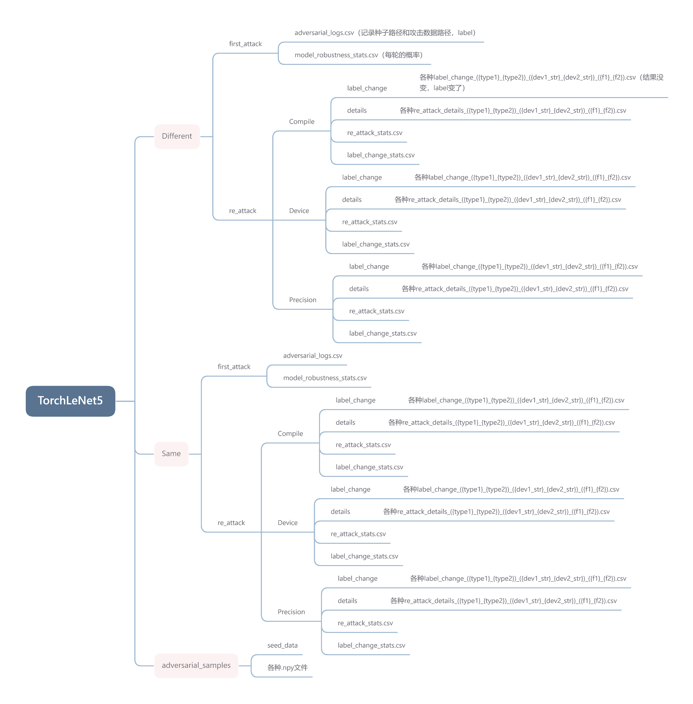

### 实验结果说明：

中间运行结果全部存放在PyTorch文件夹中，发现Same文件夹中的re_attack没有成功传上去，传上去的也不全，不过服务器上保存了。 以后会把数据直接放在别的网站上比如figshare。 
总结果在“触发鲁棒性问题汇总.xlsx”中。

关于中间运行结果：

1. batch_size=30，epoch=100，一共3000个测试用例
2. 在第一次攻击时，我们使用PyTorch默认环境，此时精度默认float32，device为torch.device('cuda')，torch.compile()参数默认全部。
   在第二次攻击时，我们使用设置的参数进行消融实验。
3. 记录change_label时只记录：
   (1) 原先攻击成功，现在依旧攻击成功但是对于攻击数据label改变的（Different）
   (2) 原先攻击失败，现在依旧攻击失败但是对于攻击数据label改变的（Same）
4. 第二次攻击时，details子文件夹和label_change子文件夹中的文件名就是我们设置的环境
5. 具体文件夹结构如下图所示，.pth和.npy文件过大，传的时候会出错，因此没有传上GitHub
   
